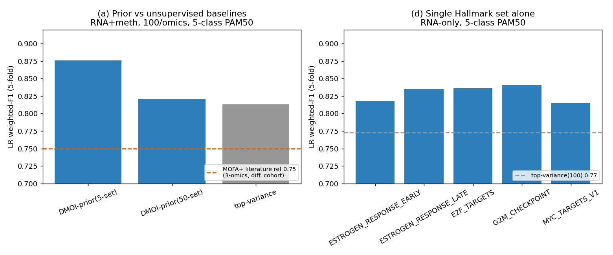

# DMOI prior vs unsupervised integration — synthesis

Public-data, label-free comparison on TCGA-BRCA PAM50 (n=620, RNA+meth).
Every selector is unsupervised (knowledge or variance); the downstream LR/SVC is the
only supervised step, so DMOI's biological prior is compared to MOFA+/MoGCN-style
selection on equal footing. See `dmoi_vs_mofa_mogcn.md` and `dmoi_prior_ablation.md`
for the full tables and caveats.

## What the experiments show

1. **Prior beats statistical selection at equal budget.** 5-set DMOI-prior LR
   weighted-F1 **0.876** vs top-variance **0.813** (100 features/omics).
2. **(a) Specificity, not breadth.** The 5 curated proliferation/ER sets
   (605 genes) beat the full 50-set catalog (4191 genes):
   0.876 vs **0.821** — widening the prior dilutes the signal back
   toward the variance baseline.
3. **(b) The edge is biological, not variance re-discovery.** Selected RNA genes barely
   overlap top-variance (Jaccard 0.036).
4. **(c) Microbiome 3rd omic deferred** — absent from the standard cBioPortal BRCA
   study and prior-free; out of scope (documented).
5. **(d) Proliferation axis is load-bearing.** Every single curated set alone beats
   top-variance(100); `G2M_CHECKPOINT` is the strongest single set and costs the most
   when dropped.

## Generalization & interpretability

6. **Task generalization (binary LumA-vs-LumB, RNA-only):** the prior edge holds and widens — 5-set AUROC **0.948** vs top-variance 0.825 (50-set 0.840); not a 5-class artifact.
7. **(1) Clinical coherence (OncoDB-style, non-circular):** fraction of selected genes associated with stage/node/age (independent of subtype): 5-set prior **0.73** vs top-variance 0.61 vs 50-set 0.50 — mirrors MOFA+>MoGCN (0.59>0.47).

## Honest scope

The MOFA+ 0.75 dashed line is a *literature reference* (Omran et al. 2025,
doi:10.1186/s12967-025-06662-5; 3-omics incl. microbiome, non-identical cohort), not a
controlled head-to-head. The controlled comparison throughout is DMOI-prior vs
top-variance on identical data, same downstream model.
